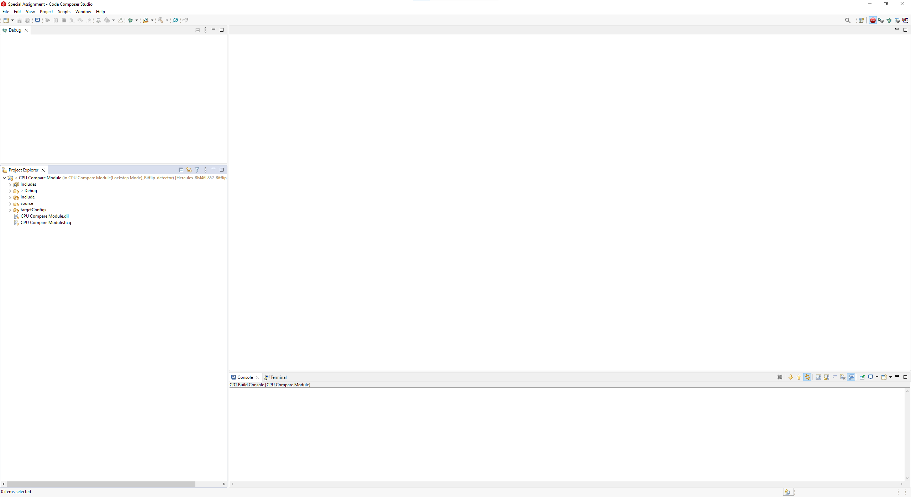
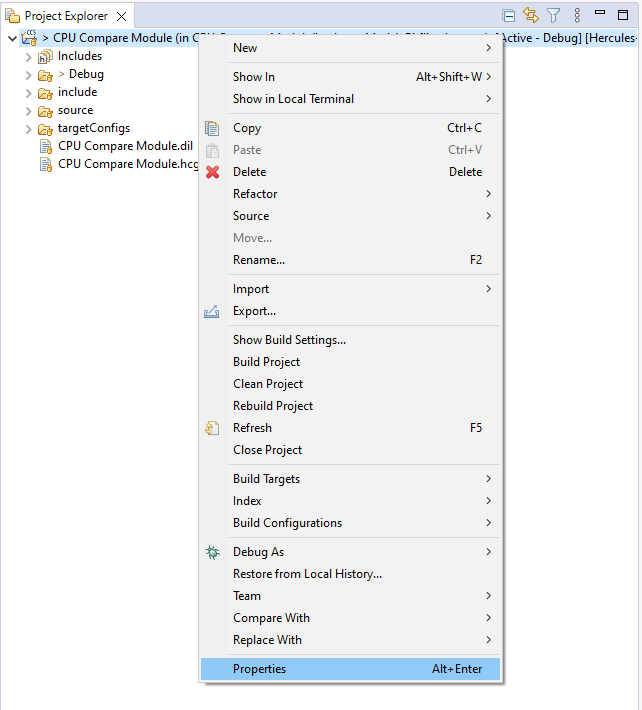
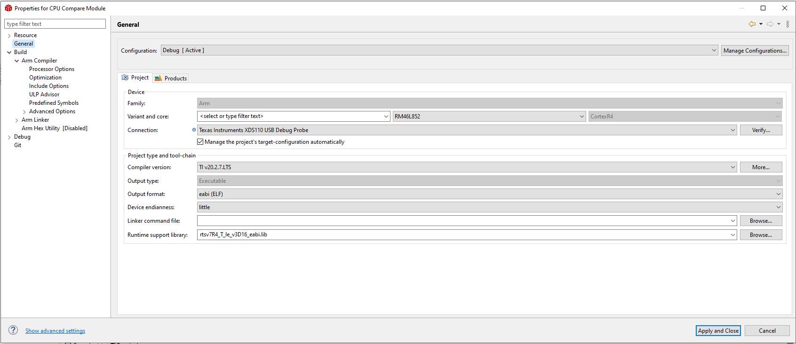
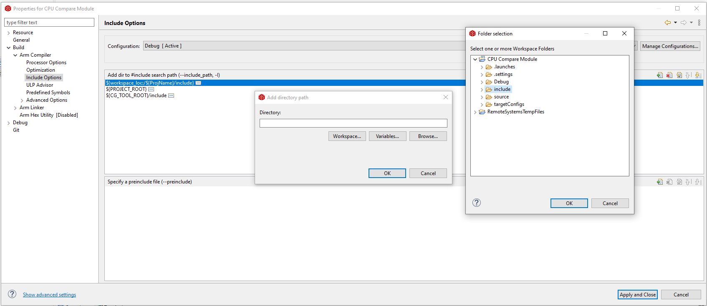
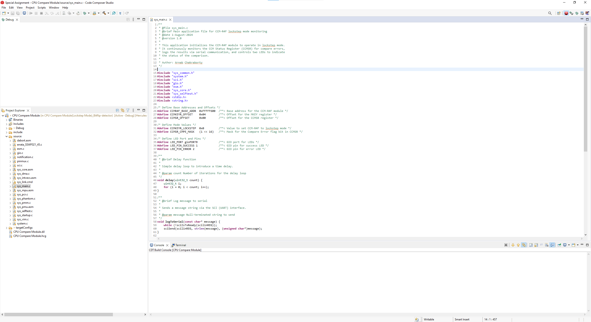
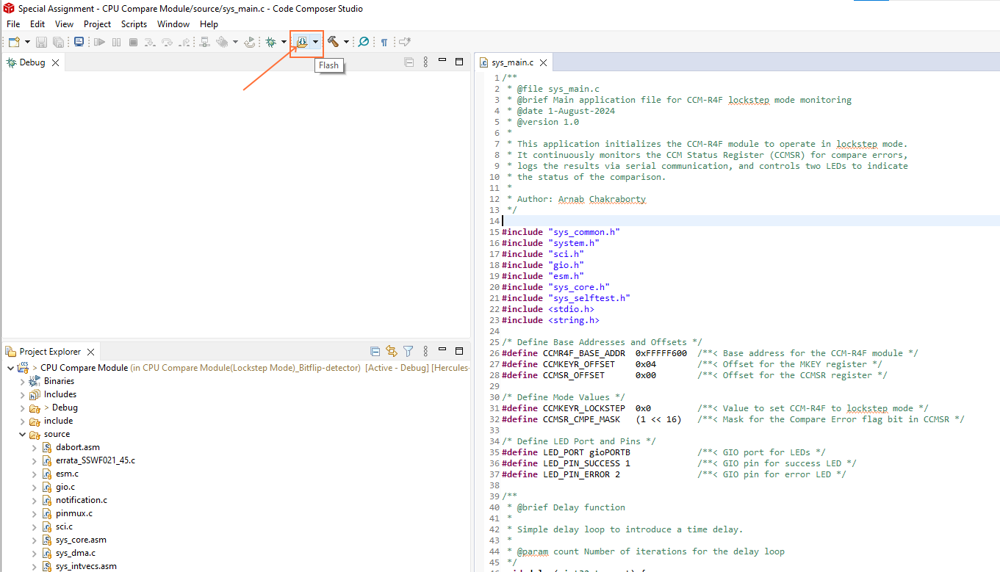
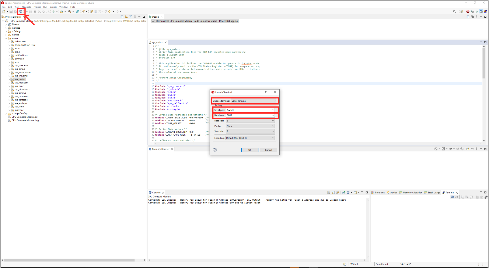
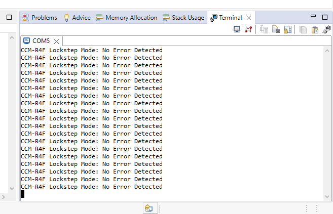
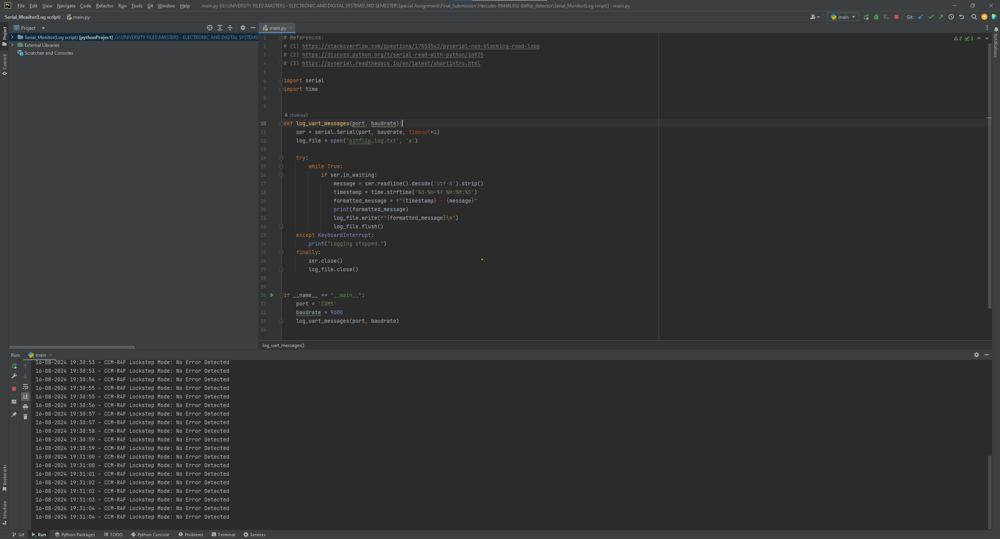
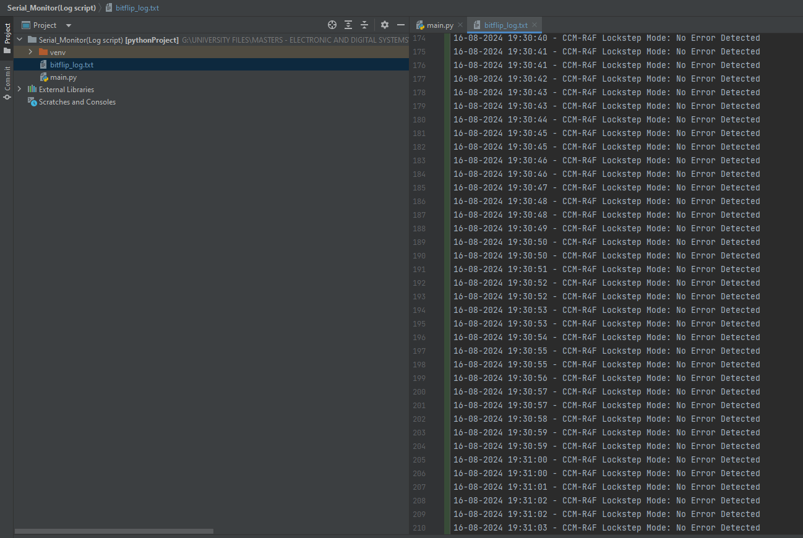

# Hercules LAUNCHXL2-RM46L852-BitFlipDetector


## Project description
The Hercules LAUNCHXL2-RM46L852-BitFlipDetector project aims to detect Single Event Upset (SEU) i.e. bit flips that might occur in the CPU operations and RAM within the Hercules RM46L852 microcontroller.The project is divided into two parts: (a)Monitoring of CPU operations using built-in lockstep mode and (b) Assigning a custom region in the RAM and filling it with Pseudo-Random Binary Sequence (PRBS-7) data and continuously verifying its checksum to detect bit flips.

In the first part, we use the built-in lockstep mode of the Hercules microcontroller to continuously compare the bus outputs of two CPU cores(Master Cortex-R4F CPU and Checker Cortex-R4F CPU) running in parallel and in case of signal mismatch which might occur due to bit flips, the CPU Compare Module for Cortex-R4F (CCM-R4F) signals an error to ESM(Error Signaling module).Our code checks the status register of the lockstep mode continuously in a loop and logs the status over serial communication along with specified LED blinking.In case of signal mismatch,it blinks the dedicated error LED to indicate the error and logs the mismatch over the serial communication.

In the second part of the project where we check for bitflips in the RAM of the Hercules microcontroller, we divided the RAM regions into two sections named custom_data_section and data_store_section and were defined in the linker script.Defined custom data section region is used for initializing the RAM with data generated using PRBS-7 and data store section region is used to store a copy of the generated PRBS-7 data used to fill the custom data section.Along with this, we also calculate the expected checksum while filling the custom data section with PRBS-7 data.Later in the continuous loop, we check if the calculated checksum matches our expected checksum or not and also we compare the custom data section with data store section to check for bitflips, count them, log them and correct the bit flips and continue the cycle to detect more bitflips. The loop continuously checks if the calculated checksum matches with the expected checksum and if the bitflip count is greater than 0. If there is checksum mismatch and bit flip count is non-zero, it notifies the user over serial communication about the mismatch and also indicates about the bit flip via assigned error LED blinking.

The ultimate goal of this project is to test the microcontroller chip against radiation-induced Single Event Effects (SEEs) by simulating space conditions using a particle accelerator.The data collected during the experiment will be used to determine the SEE cross section of the chip which is extremely important for predicting the reliability of the chip.The project aims to publish these findings which will provide valuable insights into the microcontroller’s reliability in harsh environments like space contributing to future space missions. 


## Folder and File Descriptions

The project is organized into below mentioned files,each serving a specific purpose in the detection and logging of bit flips and CPU errors caused by Single Event Effects (SEEs). Below is the description of each file and its functionality:

### CPU Compare Module(Lockstep Mode)_Bitflip-detector
- **File**: `sys_main.c`
- **Description**:
  - It is the main application for monitoring the lockstep mode of the CCM-R4F (CPU Compare Module) in the Hercules RM46L852 microcontroller.
  - The application continuously checks for the CCM Status Register's 16th bit using a bitwise AND operation for compare errors, which then notifies about errors incase there is a mismatch between the outputs of two CPU cores running in lockstep mode.
  - Errors are then logged via SCI(Serial Communication Interface) and indicated by LED status, providing real-time monitoring of the CPU in harsh environments.
  - This program helps us to know how reliable Hercules CPU is when exposed to cosmic radiation or other sources of SEEs.

### Memory(RAM)_Bitflip-detector
- **File**: `sys_main.c`
- **Description**:
  - It is the main application for detecting bit flips in a custom-defined RAM region in the linker script of the Hercules RM46L852 microcontroller. 
  - The application uses a Pseudo-Random Binary Sequence (PRBS-7) to initialize or fill the custom defined RAM region with random data and calculates an expected checksum and continuously matches it with the calculated checksum to detect bit flips.
  - If bit flips are detected, the flipped bits are immediately corrected, the number of flipped bits is counted, and the event is logged over the Serial Communication Interface (SCI) if the checksum does not match with the expected and bit flip count is greater than 0,notifying the user about the number of bitflips that occured. Additionally, the error LED indicator is toggled to signal the error, and the program continues in the loop to detect more bit flips.
  - The application is designed for radiation testing, where the reliability of the memory(RAM) is tested against SEEs during particle irradiation.

### Serial_Monitor(Log script)
- **File**: `main.py`
- **Description**:
  - This Python script was developed so that the user can see the bitflip or status messages from Hercules microcontroller via UART.
  - It continuously listens for messages from the microcontroller via assigned COM port, displays the messages in the terminal and finally logs the messages with a timestamp into the text file (`bitflip_log.txt`).
  - The script is required for logging of real-time data during testing i.e. counting the number of bit flips, which is required for determining the SEE cross section of the chip.
  - The python script helps the user to monitor the microcontroller's outputs during the irradiation tests.


## Download the repository
You can download the repository using any of the following methods:

- **Clone with SSH:**
```
  git@version.aalto.fi:chakraa3/hercules-launchxl2-rm46l852-bitflipdetector.git 
```
- **Clone with HTTPS:**
```
  https://version.aalto.fi/gitlab/chakraa3/hercules-launchxl2-rm46l852-bitflipdetector.git
```
- **Download as zip:**
1. Navigate to the repository page.
2. Click on the "Code" button (typically a dropdown on the right-hand side).
3. Select "zip" to download the entire repository as a ZIP file.
4. Extract the ZIP file to your desired location.


## Usage
To flash the codes or for uploading the codes to the microcontroller, follow the below steps:

1. At first, download the Code Composer Studio (recommended version: 12.5.0 (04 Oct 2023) or later) from the following link: [Code Composer Studio](https://www.ti.com/tool/download/CCSTUDIO/12.5.0)
   
2. Create your own workspace

3. Go to `File > Open Projects from File System > Click on Directory > Select` the program folder from the downloaded or cloned repo like `CPU Compare Module (Lockstep Mode)_Bitflip-detector`.

   

4. Once the project folder is imported, you should see the project folder in the project explorer of CCS like below:

   

5. Right-click on the project folder and click properties.

   

6. Make sure the General properties look like below where you need to set the Family, Variant, Core, and Connection (optional: do verify the connection to see if it succeeds or not):

   

7. Beside general properties, in the same window, select `Build > Arm Compiler > Include options` and click on the plus sign > `Workspace > Select include folder` and press OK (this tells the compiler where to look for the header files).

   

8. After this, you can see the application source code in project explorer under `source > sys_main.c` if you need to change something.

   

9. Finally, press the flash button on the top left side like below to upload the program to the microcontroller (Make sure you have connected the microcontroller using a USB cable to the PC).

   

10. Once the flash is successful, press the physical button (labeled as PORRST) on the microcontroller to start the program. As soon as you press the button, you should see LED2 (GIOB_1) blinking. LED2 blinks when the test is successful, i.e., no bitflips are being detected, and LED3 (GIOB_2) blinks when the test does not pass (i.e., a bitflip is detected).

    

11. To check the real-time log messages through the serial port inside the IDE, you can open a terminal from the top left corner, select Serial Terminal, and COM5 as the serial port (this might be different for your system; try other COM ports) along with the following settings: baudrate: 9600, Data size: 8, Parity: None, Stop bits: 2, and press OK. You should see the log messages in the IDE terminal now.

    
    
    

12. However, it is recommended to use the `main.py` script from the `Serial_Monitor (Log script)` folder of the repo that we developed to display the log messages with timestamps and store them in a text file named `bitflip_log.txt`. Before running the script, please close the COM5 port first and then the terminal if it was opened following the previous step and is still running in the Code Composer Studio. If it is not closed, the Python script will not be able to access the COM5 or selected port.

    
    
    

    You can check the saved log messages with timestamps in the text file `bitflip_log.txt`.

    

**📝 Note:** **You can follow the same steps for flashing the program `Memory(RAM)_Bitflip-detector` of the repo to the microcontroller.**


## Demonstration Video

## Authors and acknowledgment
- Author: Arnab Chakraborty (Masters student,Dept. Electrical and Automation,Aalto University)
- Advisor: Anton Fetzer (Doctoral Researcher,Dept. Electronics and Nanoeng,Aalto University)
- Supervisor: Jaan Praks (Associate Professor,Dept. Electronics and Nanoeng,Aalto University)

## Datasheet link
[Datasheet : Hercules LAUNCHXL2-RM46L852](https://www.ti.com/lit/ug/spnu514c/spnu514c.pdf)
- 1oo1DLockStepMode - discussed in pg no.387, status, control and key registers in pg no.390,391,392 respectively 

## License
[MIT](https://choosealicense.com/licenses/mit/)